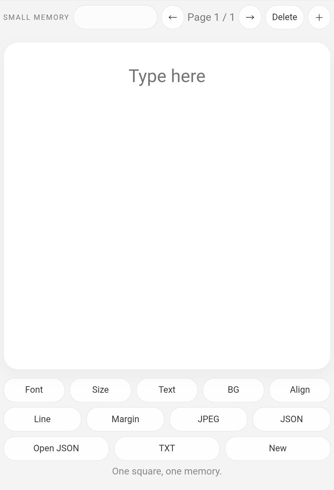

# SMALL MEMORY

小さな記憶や短い言葉を、**正方形のページ**として静かに置いていくための PWA です。  
スクロール前提のメモではなく、**スマートフォンで一画面で読める量**を、1ページごとに整理して残すことを目的にしています。

## 実行

https://masato-nasu.github.io/small-memory/

## スクリーンショット

## 特徴

- **正方形1ページ**で構成
- スマホで開いたときに**一画面で読める量**を前提
- **自動改ページ**
  - 文字が増えたら次ページへ送る
  - 文字を減らしたら前ページへ戻す
- スタイル変更を**全ページへ反映**
- **JPEG / JSON / TXT** 書き出し対応
- **PWA** としてホーム画面追加可能

## 主な機能

- テキスト入力
- ページ追加 / 切替 / 削除
- フォント切替
  - Block
  - Mincho
- 文字サイズ変更
- 文字色変更
- 背景色変更
- 配置切替
  - Center
  - Left
- 行間調整
- 余白調整
- 1ページごとの背景設定
- JPEG 書き出し
- JSON 保存 / 復元
- TXT 書き出し

## デザイン方針

- **1ページ = 1つの断片**
- 初期状態は、
  - 背景: 白
  - 文字色: 80% グレー
  - フォント: Block
  - 配置: Center
- 編集中の見え方と、書き出し時の印象が大きくずれないように設計
- UI はできるだけ下部にまとめ、本文エリアを優先

## 使い方

1. テキストを入力
2. 必要に応じて以下を調整
   - Font
   - Size
   - Text
   - BG
   - Align
   - Line
   - Margin
3. 文字量が増えると自動で次ページへ分割
4. 必要に応じてページを追加 / 切替 / 削除
5. 書き出し
   - **JPEG**: 見た目ごと保存
   - **JSON**: 再編集用
   - **TXT**: 文字だけ保存

## エクスポート

### JPEG
ページごとの完成形を画像として保存します。  
作品としてそのまま使いたい場合や、他アプリへ持っていく素材として使いたい場合に向いています。

### JSON
ページ構成やスタイル設定を含めて保存します。  
あとから編集を再開したい場合に使います。

### TXT
本文だけをテキストとして保存します。  
文章のバックアップや、他の場所への転用に向いています。

## PWAとして使う

### iPhone / iPad (Safari)
1. ブラウザで開く
2. 共有ボタンを押す
3. **ホーム画面に追加**

### Android (Chrome)
1. ブラウザで開く
2. メニューを開く
3. **ホーム画面に追加** または **アプリをインストール**

## メモ

SMALL MEMORY は、長文エディタではなく、  
**短い記憶・断章・一言・詩の断片を、正方形のページとして置くための道具**です。
